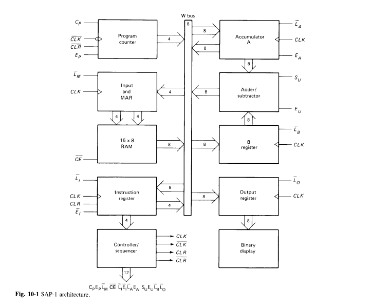
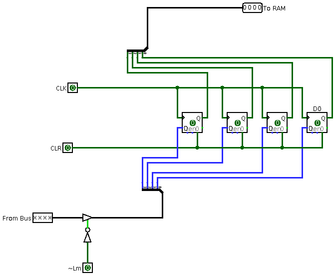
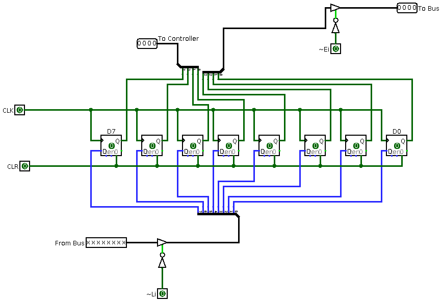
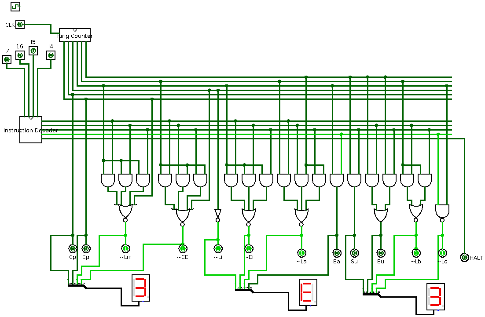
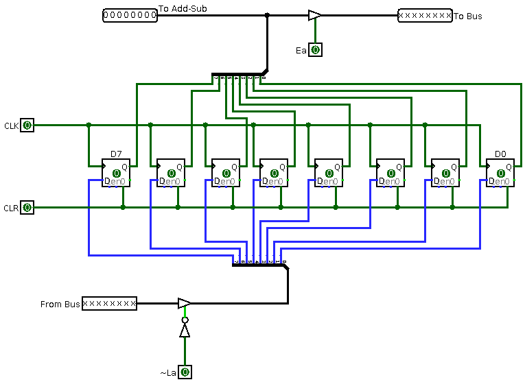
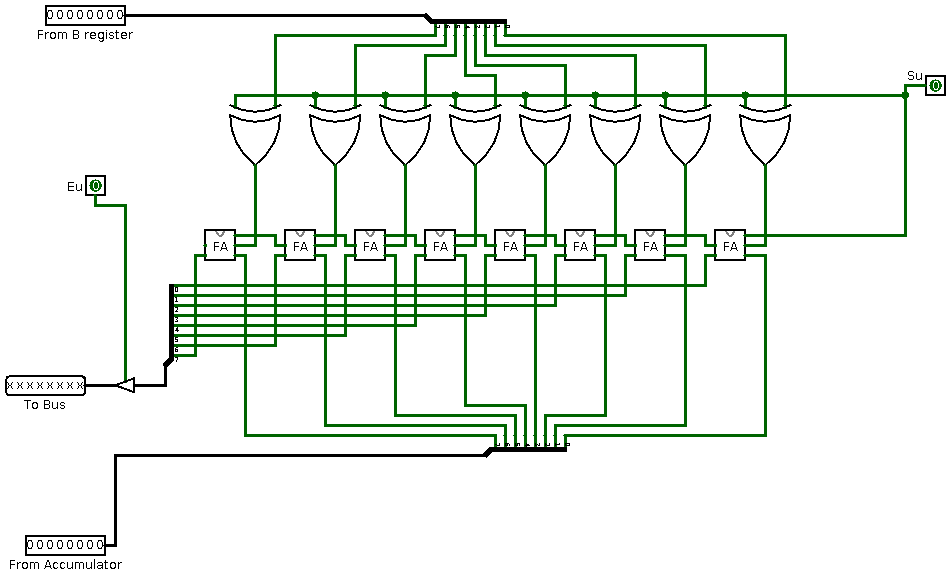
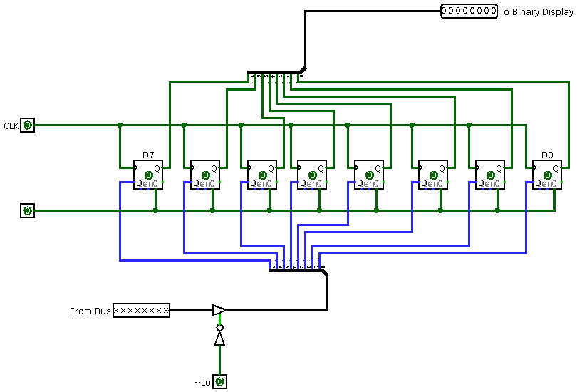
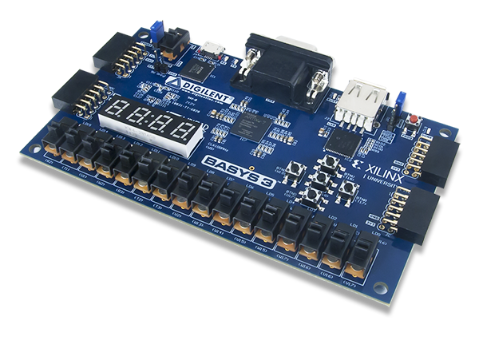
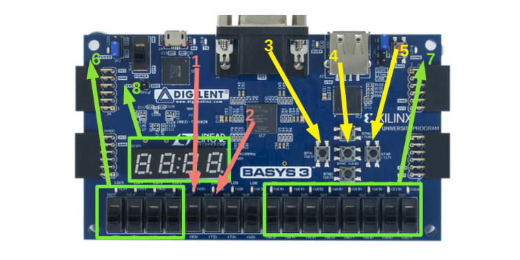

# Designing and Implementing a SAP-1 Computer

Simple as Possible (SAP) computers in general were designed to introduce beginners to some of the crucial ideas behind computer operations. SAP computers are classified into stages, each stage more evolved and considering more advanced concepts in computer architecture than the previous.

The SAP-1 computer is the first stage in this evolution and contains the basic necessities for a functional computer. Its primary purpose is to develop a basic understanding of how a computer works, interacts with memory and other parts of the system like input and output. The instruction set is very limited and is simple.

In this project, I together with a group of people implement a SAP-1 computer using an FPGA (Field Programmable Gate Array) - an integrated circuit designed to be configured by a customer or a designer after manufacturing - and the FPGA programmed using VHDL (VHSIC-HDL, Very High Speed Integrated Circuit Hardware Description Language).

## Table of Content

1. [SAP-1 Computer Architecture](#sap-1-computer-architecture)
   - [SAP-1 Components](#sap-1-components)
   - [SAP-1 Instruction Set](#sap-1-instruction-set)
2. [Design Process](#design-process)
   - [Logisim Design Images](#logisim-design-images)
3. [Implementation Process](#implementation-process)
4. [Results](#results)
   - [Programmed FPGA](#programmed-fpga)
   - [Operation Codes](#operation-codes)
5. [Learn More](#learn-more)
   - [Reference 1](#reference-1)
   - [Reference 2](#reference-2)
   - [Reference 3](#reference-3)
   - [Reference 4](#reference-4)

## SAP-1 Computer Architecture

The SAP-1 computer is a bus-organized computer and makes use of Von-Neumann architecture. It makes use of an 8-bit central bus and has ten main components. A pictorial representation of its architecture is shown below. Each of the individual components that make up this computer are described right after.

### SAP-1 Components

1. **Program Counter**: The program counter’s job is to store and send out the memory address of the next instruction to be fetched and executed. The program counter, which is part of the control unit, counts from 0000 to 1111 as the program is stored at the beginning of the memory with the first instruction at binary address 0000, the second instruction at address 0001, the third at address 0010, and so on. At the start of each computer run, the program counter is reset to 0000. When the computer run starts, the program counter sends out the address 0000 to the memory and is then incremented by 1. After the first instruction is fetched and executed, the program counter sends the next address 0001 to the memory and again, after that, the program counter is incremented. In this way, the program counter keeps track of the next instruction to be fetched and executed.

2. **Input and Memory Address Register (MAR)**: The MAR stores the 4-bit address of data or instruction which are placed in memory. When the SAP-1 is running, the 4-bit address is gotten from the Program Counter through the W-bus and then stored. This stored address is sent to the RAM where data or instructions are read from.

3. **Random-Access Memory (RAM)**: The SAP-1 makes use of a 16 x 8 RAM (16 memory locations each storing 8 bits of data). The RAM can be programmed by means of the address and data switches allowing you to write to the memory before a computer run. During a computer run, the RAM receives its 4-bit address from the MAR and read operation is performed. In this way the instruction or data word stored in the RAM is placed on the W bus for use in some other part of the computer.

4. **Instruction Register**: The instruction receives and stores the instruction placed on the bus from the RAM. The content of the instruction register are then split into two nibbles. The upper nibble is a two-state output that goes into the Controller-sequencer while the lower nibble is a three-state output that is read from the bus when needed.

5. **Controller-Sequencer**: The controller-sequencer sends out signals that control the computer and makes sure things happen only when they are supposed to. The 12 bit output signals from controller-sequencer is called the control word which determines how the registers will react to the next positive clock edge. It has the following format:
   ` CON = Cp Ep ~Lm ~CE ~Li ~Ei ~La Eu Su Eu ~Lb ~Lo`

6. **Accumulator**: The accumulator is an 8-bit buffer register that stores intermediate answers during a computer run. The accumulator has two outputs. The two-state output goes directly to the adder-subtractor and the three-state output goes to the bus. This implies that the 8-bit accumulator word continuously drives the adder- subtractor but only appears on the W bus when Ea is high.

7. **Adder-Subtractor**: The adder-subtractor asynchronously adds to or subtracts a value from the the accumulator depending on the value of Su. It makes use of 2’s complement to achieve this When Su is low the output of the adder-subtractor is the sum of the values in the accumulator and in the B-register (O/P = A + B). When Su is high, the output is the difference between them (O/P = A + B’).

8. **B-Register**: The B-register is a buffer register used in performing arithmetic operations. It supplies the number to be added or subtracted from the contents of the accumulator to the adder/subtractor. When data is available at the bus and Lb is low, at the positive clock edge, B register gets and stores the data.

9. **Output Register**: The output register gets and stores the value stored in the accumulator usually after the performance of an arithmetic operation. The answer that is stored in the accumulator is loaded into the output register through the W bus. This is done in the next positive clock edge when Ea is high and Lo is low. The processed data can now be displayed to the outside world.

10. **Binary Display**: The binary display is row of eight light emitting diodes(LEDs). The binary display shows us the contents of the output by connecting each LED to the output of the output register. This therefore enables viewing of the answer transferred from the accumulator to the output register in binary.

### SAP-1 Instruction Set

The instruction set of a computer are the basic operations it can perform. The instruction set of the SAP-1 is described in table below.

| Operation | Description                                             |
| --------- | ------------------------------------------------------- |
| Load      | Load data from memory to the accumulator                |
| Add       | Add data from memory to value in the accumulator        |
| Subtract  | Subtract data from memory from value in the accumulator |
| Output    | Load data from accumulator to the output register       |
| Halt      | Stop processing                                         |

For more details about programming the SAP-1 and the fetch and execution cycle of the SAP-1, check out [reference #1 in the Learn More section](#reference-1)

## Design Process

To build the SAP-1 computer, circuit diagrams were designed for each component. These component were then integrated into one system using buses. Each circuit diagram was designed and simulated with [Logisim](http://www.cburch.com/logisim/), a tool for designing and simulating logic circuits. The [logisim design file can be found here](./logisim_design.circ).

### Logisim Design Images

_Program Counter_

_Input and Memory Address Register_

_RAM_

_Instruction Register_

_Controller-Sequencer with 7-segment displays to view control word in Hex_

_Accumulator_

_Adder/Subtractor_

_B-Register_

_Output Register_

_7-Segment Display Driver for Hex Display. Required to convert 4 bit binary numbers into more readable Hex format._

_Overall System_

## Implementation Process

To implement the SAP-1 computer, a Basys 3 Field Programmable Gate Array (FPGA) was used. FPGAs are integrated circuits designed to be configured by a customer or a designer after manufacturing. FPGAs are predominantly programmed using HDLs (hardware description languages). For this project, the hardware description language used was VHDL.

VHDL stands for VHSIC (Very High Speed Integrated Circuit) Hardware Description Language and is one of the most common hardware description languages. Hardware description languages are used to “describe” digital hardware. They are similar but fundamentally different from high-level programming languages. While high-level software code specifies a sequence of operations, HDL code is more like a schematic that uses text to introduce components and create interconnections. [Learn more about VHDL](#learn-more).

The Basys 3 is an entry-level FPGA development board designed exclusively for Vivado Design Suite, featuring Xilinx Artix-7 FPGA architecture. Vivado is a design environment for Xilinx FPGA products and is closely linked to such chip architecture and can not be used with FPGA goods of other vendors. To write HDL code to run on the Basys 3, [Vivado Design Suite](https://www.xilinx.com/products/design-tools/vivado.html) had to be first installed and a new project created. Vivado's [getting started guide](https://reference.digilentinc.com/vivado/getting_started_tutorial/start) walks you through the entire process of creating/opening a project, down to programming the device with the code you've written. The [Vivado project for the SAP-1 Computer](./SAP1_VIVADO_PROJECT_FOLDER) is included in this repository for ease of use. VHDL code written for each component can be found in the [src directory](./SAP1_VIVADO_PROJECT_FOLDER/SAP1.srcs/sources_1).

_Basys 3 FPGA_

## Results

### Programmed FPGA

The result of sucessfully implementing the SAP-1 by programming the FPGA using VHDL is shown using the image below.

_Programmed FPGA_

1. **Run program switch** - Flipping this switch runs the program written to the RAM.
2. **Display RAM value switch** - Display the value currently in a specified RAM location using the HEX display. The location in the RAM is specified using the RAM address switches (#6)
3. **Write to RAM button** - This button writes whatever value is specified by the RAM data switches (#7) to a specific RAM location. The location in the RAM this data is written to is specified using the RAM address switches (#6)
4. **RESET SAP-1 button** - Reset the SAP-1. Clear RAM and registers.
5. **Clear RAM button** - Clear data written in the RAM. Clears data in all RAM locations.
6. **RAM address switches** - These 4 switches selects a RAM location to perform an action on. 4 switches represent 4 bits (0000 - 1111) to select any of the 16 RAM locations.
7. **RAM data switches** - These 8 switches are used to specify data/instructions to write into any RAM location. 8 switches indicate that 8 bit data can be inserted into a RAM location; binary (00000000 - 111111) or hex (00 - FF). The first four bits specify the operation and the last 4 specify the operand.
8. **HEX display** - Displays output to the user. The first two digits show the selected RAM location. The last two digits display the value stored in the selected RAM location or the result from the output register after running a program.

### Operation Codes

Each operation in the SAP-1's instruction set have been mapped to 4 bits. These 4 bits make up the first 4 of the total 8 bits that are stored in each RAM location. The last 4 bits specify the operand which the operation will act on.

Example - 10110001 will _load_ (1011) the operand 1 (0001) to the accumulator.

- **LOAD** - 1011
- **ADD** - 0101
- **SUBTRACT** - 0111
- **OUTPUT** -0000
- **HALT** - 0100

## Learn More

- #### Reference 1
  [Digital Computer Electronics by Albert Paul Malvino, _page 140_](https://drive.google.com/file/d/1g9VK7DQuiCMUlins-J77bPicDu4BEXPz/view?usp=sharing) ]
- #### Reference 2

  [Collated Project Report](https://drive.google.com/file/d/17fH-JBU5OX_4AG123AO47y879YxzmDwX/view?usp=sharing)

- #### Reference 3

  [VHDL Tutorial by Jan Van der Spiegel ](https://www.seas.upenn.edu/~ese171/vhdl/vhdl_primer.html)

- #### Reference 4

  [What Is VHDL? Getting Started with Hardware Description Language for Digital Circuit Design](https://www.allaboutcircuits.com/technical-articles/hardware-description-langauge-getting-started-vhdl-digital-circuit-design/)
